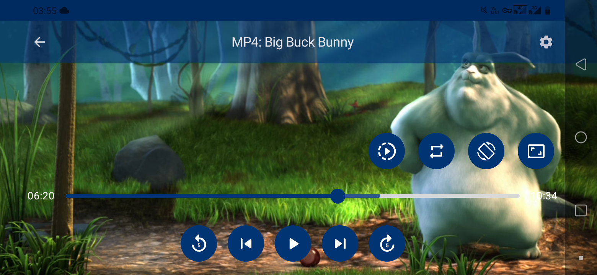
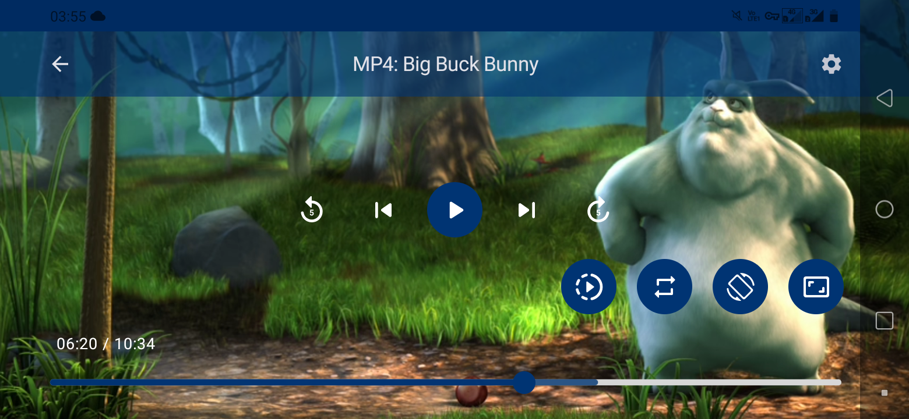
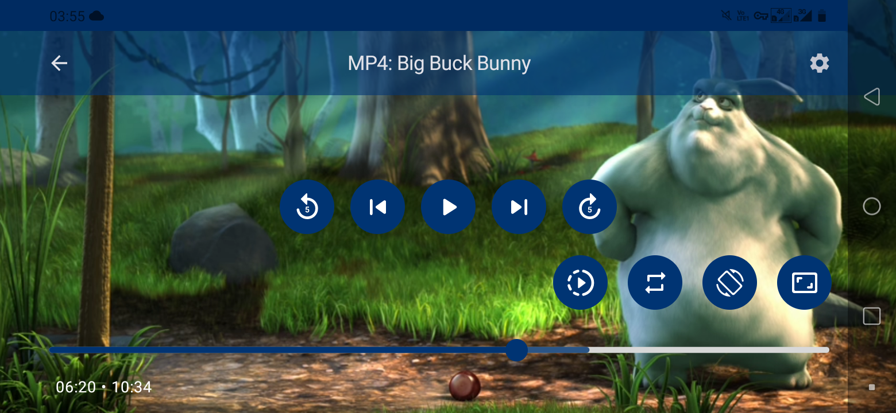

  

<h1 align="center">
	Simple Player
</h2>

  
   
   

  
See a demo

https://github.com/jsericksk/Simple-Player/assets/36176569/c5fb6aa0-4560-4e38-8ff9-6d44293f71c6

https://github.com/jsericksk/Simple-Player/assets/36176569/43335cb6-f4d8-43ec-a841-9a43ee677049

The main objective of this project was to facilitate the creation of a custom video player layout with Compose, aware of the lifecycle and with a state that survives configuration changes and also system-initiated process death. It is just a basic demonstration project of how a basic video player can be created with ExoPlayer and Jetpack Compose.

The player has common basic functions, such as changing the current video, playback speed, aspect ratio, screen orientation, etc. It is fullscreen by default, and it hides the main buttons after a defined time or a tap on the screen.

## Download

You can download the apk from the [releases](https://github.com/jsericksk/Simple-Player/releases) if you want to test it on your device.

## Basic Version

A more basic version of this project can be found in the [basic-version branch](https://github.com/jsericksk/Simple-Player/tree/basic-version), created to serve as an example for an article on Medium. [Read my article on Medium](https://medium.com/@jsericksk/creating-a-custom-layout-video-player-with-media3-exoplayer-and-jetpack-compose-a87b6b478ebc) if you want to see more information about this project.

## Libraries Used

- [Media3/ExoPlayer](https://developer.android.com/media/media3): For creating the media player.
- [Seeker](https://github.com/2307vivek/Seeker): For creating a custom Slider.